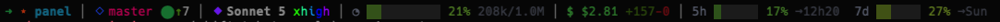

```
 ___________ / /____ _/ /___ _____
/ __/ __(_-</ __/ _ `/ __/ // (_-<
\__/\__/___/\__/\_,_/\__/\_,_/___/
```

Status line para o Claude Code CLI. Um script bash que lê JSON do stdin (payload passado pelo Claude Code a cada render) e imprime uma linha ANSI colorida com diretório, git, modelo, uso de contexto, custo da sessão e rate limits.

Este README é escrito para um agente (Claude Code ou outro) instalar e configurar isso sozinho, sem intervenção humana além de aprovar os comandos.

## Instalação (para o agente executar)

```bash
curl -fsSL -o ~/.claude/ccstatus.sh https://raw.githubusercontent.com/luizfbalves/ccstatus/main/ccstatus.sh
chmod +x ~/.claude/ccstatus.sh
```

Depois, editar `~/.claude/settings.json` (criar se não existir) e garantir a chave `statusLine`:

```json
{
  "statusLine": {
    "type": "command",
    "command": "bash \"~/.claude/ccstatus.sh\""
  }
}
```

Se o arquivo já tiver outras chaves, fazer merge — não sobrescrever o settings.json inteiro. Não é necessário reiniciar o Claude Code; a statusline é reavaliada a cada render.

### Dependências

`bash`, `jq`, `git`, `awk`, `date` — todas usualmente já presentes em macOS/Linux. Sem dependências de rede, sem pacotes npm/pip. O script não escreve em disco nem faz chamadas externas; é puramente stdin → stdout.

### Verificar que funcionou

```bash
echo '{"workspace":{"current_dir":"'"$HOME"'"},"model":{"display_name":"Test Model"},"context_window":{"total_input_tokens":50000,"context_window_size":200000,"used_percentage":25},"cost":{"total_cost_usd":1.23,"total_lines_added":10,"total_lines_removed":2}}' | bash ~/.claude/ccstatus.sh
```

Deve imprimir uma linha colorida sem erros no stderr.

## Contrato de entrada (o que o Claude Code envia)

O script lê um único JSON via stdin. Campos usados (todos opcionais — a seção correspondente da linha é omitida se ausente):

| Campo | Tipo | Uso |
|---|---|---|
| `workspace.current_dir` / `cwd` | string | diretório exibido (basename) |
| `model.display_name` / `model.id` | string | nome do modelo |
| `cost.total_cost_usd` | number | custo USD acumulado da sessão |
| `cost.total_lines_added` / `total_lines_removed` | number | diff de linhas na sessão |
| `context_window.total_input_tokens` | number | tokens usados |
| `context_window.context_window_size` | number | limite de tokens da janela |
| `context_window.used_percentage` | number | % pronto (senão é calculado) |
| `rate_limits.five_hour.used_percentage` / `.resets_at` | number / epoch | barra da janela de 5h |
| `rate_limits.seven_day.used_percentage` / `.resets_at` | number / epoch | barra da janela de 7d |
| `fast_mode` | boolean | badge `⚡fast` ao lado do modelo quando `true` |
| `effort` | string | badge `◎<nível>` (low/medium/high) ao lado do modelo quando `fast_mode` não está ativo |

Git não vem no payload — o script roda `git -C "$cwd"` diretamente no diretório recebido.

## Estrutura interna (para quem for editar)

- `rgb <r> <g> <b>` — helper que gera escape ANSI truecolor (24-bit) a partir de componentes RGB (0-255)
- `pct_rgb <pct>` — interpola RGB num gradiente contínuo verde `(21,128,61)` → âmbar `(180,120,16)` → vermelho `(185,28,28)`, sem degraus fixos
- `pct_color <pct>` — mesma coisa que `pct_rgb`, já formatada como escape ANSI pronto para `printf`
- `bar <pct> <largura>` — desenha barra `▓`/`░` de `largura` colunas (default 10 para contexto, 6 para rate limits), colorida via `pct_color`
- `fmt_tokens <n>` — formata `50000` → `50k`, `1500000` → `1.5M`
- Ícones usam variantes "medium/large" do Unicode (`➜ ⬦ ⬤ ↑ ↓ ⬥ ◔ $ →`) do bloco Miscellaneous Symbols and Arrows — visualmente mais pesados que os básicos `◇◆●`, mas com suporte de fonte um pouco menos garantido (mais recentes, ~2008); se algum virar caixa vazia (tofu) num terminal específico, trocar pela variante clássica do mesmo formato (ex.: `⬥`→`◆`, `⬤`→`●`, `⬦`→`◇`) resolve sem mudar o resto do layout. Todos os ícones são envolvidos em `${BOLD}` para reforçar o peso visual. Git dirty/clean usa `⬤` colorido (vermelho/verde) em vez de check/x, no estilo do indicador do VS Code
- `STAR_FRAMES` — estrela pulsante (`✦ ✧ ⋆ · ⋆ ✧`) logo após a seta, trocando de frame a cada segundo (`date +%s % tamanho do array`); é o único elemento "animado" — não há mascote/imagem, statusline é texto puro re-renderizado a cada tick do Claude Code, então o efeito é uma sequência de frames por tempo, não animação fluida
- Cada seção da linha (`git_part`, `model_part`, `cost_part`, `ctx_part`, `rate_part`) é montada isoladamente e só concatenada ao final se não-vazia, separada por `SEP` (` │ ` em cinza médio)
- A paleta (`GREEN`, `RED`, `GREY`, `DARK`, etc., topo do arquivo) usa tons médio-saturados (estilo "600" do Tailwind) escolhidos para manter contraste tanto em terminal claro quanto escuro — evite voltar a pastéis claros ou quase-pretos, eles só funcionam bem num dos dois temas

Para mudar os pontos do gradiente: editar os RGBs em `pct_rgb` (e o bloco equivalente inline em `cost_part`, que usa a mesma fórmula escalada para o teto de custo). Para mudar largura das barras: editar os literais `10`/`6` nas chamadas a `bar`. Para adicionar uma seção nova: seguir o padrão — montar `<nome>_part=""`, preencher condicionalmente, e adicionar `[ -n "$<nome>_part" ] && parts="${parts}${SEP}${<nome>_part}"` perto do final do arquivo, antes do `printf '%b' "$parts"`.

## Preview



```
➜ ⋆ orulpro │ ⬦ main ⬤ │ ⬥ Sonnet 5 │ ◔ ▓▓▓▓▓▓░░░░ 55% 550k/1.0M │ $ $1.95 +69-37 │ 5h ▓▓▓░░░ 55% →12h33  7d ▓▓░░░░ 26% →Sun
```

Requer terminal com suporte a truecolor (24-bit ANSI) — a maioria dos emuladores modernos (iTerm2, Terminal.app, Windows Terminal, Alacritty, kitty, WezTerm) já suporta por padrão. Sem Nerd Font necessária.

## Atualizar depois de instalado

Re-executar o comando de instalação sobrescreve `~/.claude/ccstatus.sh` com a versão mais recente do `main`. Não há versionamento/pin — se for preciso reprodutibilidade, fixar um commit SHA na URL do `curl` em vez de `main`.
